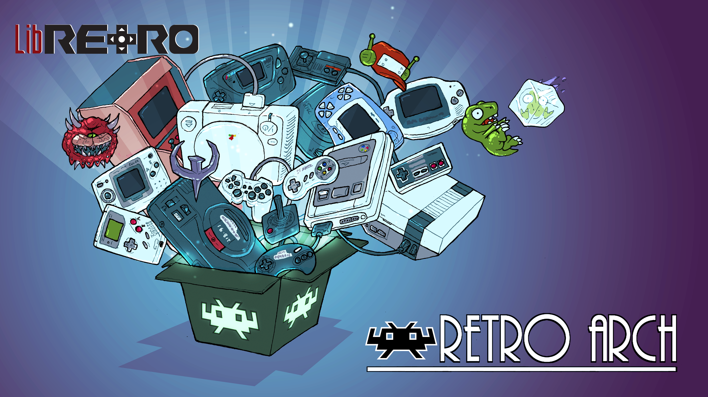
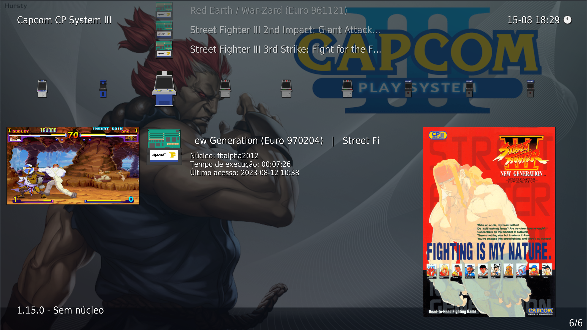

# The best of Retroarch for Linux Project
Retroarch configured for Arch Linux and Linux in general.

# Initial setting
Download retroarch on your Linux, the default system settings are always in /home/user/.config/retroarch.
The configuration of this repository is already pre-configured to point directly to ~/.config regardless of the active user.

# Be part of the project
Do you want to be part of the project and make the retroarch linux version even more complete and beautiful? Get in touch with me or you can also create a fork for another project parallel to mine!

## Linux modification
Retroarch was configured from scratch, using some packages found on the net, such as:
- Wallpaper from Crazymac project
- Bezzels for all games
- Mega Bezels pack for shaders (CRT) and configured without TV curvature (Default comes with curvature)
- All roms (games) have their overlays (roms not inclueses).

## Games (Roms)
Roms must all be NO-INTRO or REDUMP (RECOMMENDED), or edit all the roms you download.

- [Redump](http://redump.org)
- [No-Intro](https://no-intro.org)

All roms should be REDUMP preferably, thus making retro arch configuration files with playlists.lpl and core configs (OVERLAYS) defaults.

## BIOS
The system folder, where the bios are located, were also not available here in the repository, but they are files that are easy to find on [google](www.google.com).
